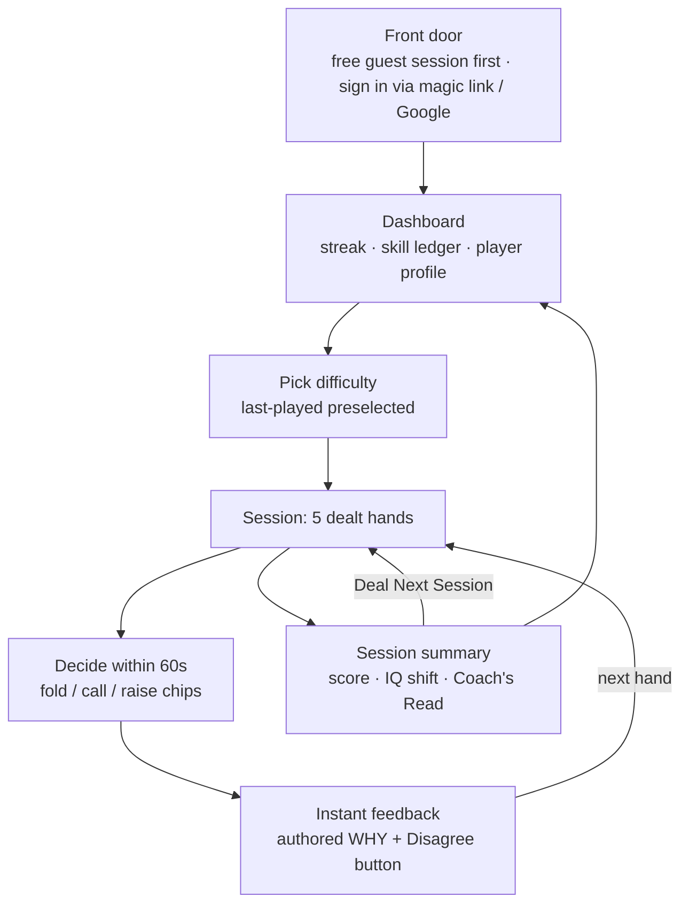

# CheckRaise — The Founder's Dossier

*Rebuilt July 24, 2026. Purpose: give the founder in-depth working knowledge of the whole system — the experience, the algorithms under it, and where it's going — deep enough to answer detailed questions from investors, mentors, engineers, and poker players without notes. This is also a grounding document: paste it into any AI chat to rehearse Q&A against it. The full engineering record lives in CLAUDE.md and the RESEARCH_*.md docs.*

---

## 1. Elevator pitch

CheckRaise is a Texas Hold'em trainer that finds the specific leak in your game and coaches you like a human would. You play short, realistic hands; the engine grades your judgment, spaces your mistakes back at you until they're fixed, and — uniquely — diagnoses the *belief* driving your errors, not just the score. No competitor does belief-based diagnosis from real decision data: solver tools tell you what the optimal play was, CheckRaise tells you why you keep not making it.

---

## 2. The experience, mapped

The player's loop, with what the system is doing invisibly at every step:

| What the player sees | What the engine does underneath |
|---|---|
| **Front door** | Guest-first (the Duolingo-style deferred-signup pattern, July 2026): the primary CTA deals a free session with no account — sign-in (Supabase magic link / Google) sits behind a quiet "Already have an account?" reveal. The guest session lives as an untagged local profile that migrates cleanly into the account on first sign-in — the trial is never wasted data. |
| **Dashboard** | Nothing here is stored as a display value — skills, streak, schema, Poker IQ, coach-read history are all *derived live* from the append-only session log (see §5). Stale numbers self-heal on every load. |
| **The deal** | Not random. The session builder (§3.1) assembles 5 hands: unseen content first, 2 slots biased toward your weak skills, up to 2 resurfaced past misses on a spaced schedule (always labeled — the app never quietly re-tests you), contrast pairs seated adjacent, max 2 preflop spots. |
| **The decision** | 60-second clock; decision time is captured per hand. Fast + wrong (≤15s) is flagged as a *confident miss* — a mistake you don't know you're making — and treated specially downstream. |
| **Feedback** | Pre-written, instant, no API call. Every explanation must argue the WHY (price, position, villain type) — explanation quality is the product's highest-leverage feature (§6). A one-tap "Disagree?" files a structured dispute. |
| **Summary** | The one live AI call per session: the Coach's Read (§3.4), structured field notes on the session's pattern. Skill ratings update, the IQ before→after is real math, streak day is secured. |
| **The loop** | "Deal Next Session →" chains immediately — but chained same-day sessions can't cheat the spacing algorithm (calendar-day floor, §3.1). Streak + Rebuy mechanics (§3.5) carry the habit. |

Side mode: **Table Reads** — watch a hand replay, name the player archetype from the betting alone. Trains *forming* reads instead of receiving them. Its design (short classification trials, immediate feedback, confusable pairs) independently matches the validated perceptual-learning method from medical training research.

---

## 3. The algorithms

### 3.1 The session builder (spaced repetition, v2)

The dealer is the pedagogy. Each 5-hand session is assembled by rule:

- **Unseen first** — new content outranks repeats.
- **Weak-skill targeting** — 2 of 5 slots prefer scenarios tagged with your red/yellow skills.
- **The graduation ladder** — a missed hand is not "reviewed once and done." It resurfaces on an expanding interval of **2 → 5 → 13 sessions** and must be answered correctly **2 spaced times** to graduate (**3** if it's been missed more than once — repeat offenses are stickier errors, per the hypercorrection-relapse literature). A new miss resets the ladder.
- **Calendar-day floor** — a resurfaced miss requires at least one *calendar day*, not just N sessions. Without this, chaining five sessions in one evening is massed practice wearing spaced repetition's clothes.
- **Surge relief** — normally 1 resurfaced hand per session; while a player's remediation queue is deeper than 8 hands, it surges to 2. (Found by simulation: at realistic accuracy, 1 slot per session mathematically cannot drain the queue.)
- **Confident misses jump the queue** — fast-and-wrong errors resurface first.
- **Contrast pairs** — look-alike scenarios with opposite answers (same price, different villain → opposite play) are authored as pairs and dealt *adjacent*, because juxtaposition is what makes the contrast teach. This is interleaving, implemented in content.
- **Honest labeling** — every resurfaced hand carries a visible "↩ You missed this one before" chip.

**What we deliberately did NOT build:** an Anki-style adaptive scheduler (SM-2/FSRS) with per-item ease factors. The evidence says that at a ~170-scenario pool, a fixed ladder performs within noise of adaptive scheduling and is enormously more debuggable. Knowing what you didn't build, and why, is half of this document's job.

### 3.2 The rating engine and Poker IQ

- **Eight skills** (preflop, position, aggression, bet sizing, bluffing, pot odds, reads, opponent adjustment), each rated by **true accuracy**: correct = 1, partial = 0.5, wrong = 0, over all lifetime attempts. Green ≥75%, yellow 50–74%, red <50%, gray until 5 attempts. No invented point systems anywhere.
- **Poker IQ is recency-weighted where it matters.** Displayed IQ scores each skill on its **last 8 hands** (once 8+ samples exist; lifetime accuracy as fallback). Why: pure lifetime accuracy is structurally backward-looking — our simulated "Improver" persona climbed from 45% to 85% accuracy while his lifetime score *dropped through* his fastest improvement. The window size was swept empirically (5/6/8/20); 8 gave honest trend-tracking with the lowest session-to-session volatility.
- **Deliberate split:** only the *display* is recency-weighted. The skill ratings and the diagnosis engine stay lifetime-based on purpose — the ledger is a record, the IQ is a pulse.

### 3.3 The schema diagnosis engine (the moat)

Six named mental models behind losing play — e.g. The Conflict Avoider ("I shouldn't put money in unless I'm sure"), The Gambler ("any two cards can win"), The Overaggressor ("pressure wins pots").

**The key insight: direction of error.** Two players with identical 60% accuracy can have opposite diseases — one folds when raising was right, the other raises when folding was right. Accuracy can't tell them apart; direction can. So the engine is a **hybrid**:

- **Three direction schemas** are scored from a lifetime tally of error direction on the ordinal axis fold < call < raise: choosing more-passive-than-recommended is `under` (→ Conflict Avoider), calling when folding was right is `loose` (→ Gambler), raising over a call/fold spot is `over` (→ Overaggressor).
- **Three skill schemas** (Positional Blind Spot, Results Thinker, Exploitable Regular) are scored from absolute skill weakness.
- Highest severity wins; no qualifying signal → an honest fallback ("Balanced Player," or "Student of the Game" when the whole ledger is still developing) instead of a forced label.

**The calibration depth** (this is what to cite when someone probes rigor): raw direction shares are scored against a *computed baseline*, not a flat threshold — the scenario pool's own answer distribution means a player who errs uniformly at random still shows ~53% "under" errors, so severity is measured as *excess over baseline*, with three anti-noise gates: a minimum evidence count, a plurality requirement, and a materiality floor (your miss *rate* must be high enough for any direction story to be honest). Every constant was tuned against simulation and is regression-gated in CI.

**The story that proves the method:** engine v1 scored accuracy only. Synthetic playtesting caught it labeling a passive, scared player "The Overaggressor" — the exact opposite of the truth — because his misses happened to land on aggression-tagged scenarios. The v2 direction rebuild eliminated opposite-direction labels entirely (verified at zero across every persona trial, every session, 15 trials). External validation: our design independently mirrors SISM, the academic state-of-the-art cognitive-diagnosis model (skills and misconceptions scored jointly). We reinvented published research without knowing it existed.

### 3.4 The Coach's Read

One live AI call per session (Claude, server-side only, 5/user/day, spend-capped). The output is **structured JSON** — headline / evidence / watch-for — schema-constrained at the API level, with graceful prose fallback.

The prompt encodes the product's coaching philosophy as hard rules: the *direction* of mistakes is the read; confident misses lead when they cluster; never invent details not in the data; never use solver language; and — as of July 2026 — the voice is **session-scoped field notes** ("here's what I noticed today"), never a trait verdict ("you're too passive"), because five hands can't honestly support a diagnosis. The accumulated Coach's Notebook is where longitudinal patterns live; a Pro-tier *meta-read* across weeks of notes is the roadmap's diagnosis-weight feature.

The prompt is not trusted — it's evaluated. A harness replays nine synthetic player types through the real prompt after any change; output is judged against a written six-point quality bar plus mechanical checks. Round one of live evaluation caught the model inventing hand details and using solver language; both are now banned in the prompt and checked by the harness.

### 3.5 Engagement mechanics (deliberately minimal)

Streak only — no XP, no coins, no badge economy (the overjustification literature: extrinsic rewards erode intrinsic motivation). One borrowed mechanic, renamed into the game's world: the **Rebuy**, a streak freeze earned at 7-day milestones (Duolingo measured −21% churn for its equivalent, the genre's most validated retention feature). Broken streaks get a designed moment — your 30-day consistency record and a one-tap restart — because a bare reset-to-zero is a documented abandonment cliff. Earned moments (a quiet gold 5/5, a personal best) are understated on purpose.

### 3.6 Opponent modeling

Seven villain archetypes plus Unknown, each with authored behavioral notes that scenarios grade against ("this jam from a nit is a fold; from this maniac it's a call"). The taxonomy was research-verified in July 2026: unsupervised clustering of real hand histories finds 7 player types; taught taxonomies top out around 6-8 — ours sits exactly at the empirical ceiling of trainable. Table Reads is the training ground for *forming* these reads; its confusable-pair authoring (nit↔tight, passive↔station) is the canonical discrimination-training method.

---

## 4. The quality system (why this wasn't vibe-coded)

This is the section to walk a skeptic through. The codebase is enforced by machines, not discipline:

- **Invariant checker** — architecture rules (single-file ownership of every external service, no secrets client-side, row-level security on every table) run as exit codes on every change. Prose rules drift; exit codes don't.
- **Content auditors** — scripts that *recompute the poker* in all 172 scenarios: pot arithmetic re-derived, bets checked against stated stack depths, out-counts verified against printed boards, grading-consistency rules. A separate auditor gates the Table Reads pool. These catch real authoring errors routinely.
- **Synthetic playtesting** — 8 simulated player personalities (a passive avoider, a gambler, an improver, a strong reg…) play tens of thousands of hands through the *real* engine on a simulated multi-day clock. This harness caught: the opposite-label diagnosis bug, the un-drainable remediation queue, a duplicate-deal bug, and the IQ formula's inability to show improvement. It is now the acceptance gate for any engine tuning.
- **Schema-bias simulator** — fails CI if the diagnosis engine develops structural bias toward any label.
- **Coach eval harness** — nine personas through the real prompt, mechanical checks plus a written quality bar, re-run on any prompt change.
- **Browser end-to-end suite with geometry guards** — real-browser tests that assert element *dimensions and overlaps*, built after a shipped bug where every functional test stayed green while the table rendered as a vertical line. Functional green + destroyed UI is a class of bug we now test for by name.
- **The ratchet law** — every bug ever found becomes a permanent mechanical check in the same session it's fixed. A fix that leaves no check behind is classified as a process failure. The net only grows.
- **CI runs all of it on every push.** The definition of done isn't discipline; it's law.
- **AI review policy** — model-driven code review runs only on diffs (a second model reviews each build), never as scheduled sweeps; the always-on layer is deterministic. AI wrote much of the code; machines and adversarial process keep it honest. That's the accurate answer to "was this vibe-coded": *the code generation was AI-accelerated, the engineering judgment — what to build, what to reject, how to verify — is the product.*

---

## 5. The data architecture (one idea, applied everywhere)

**Everything is derived from an append-only event log.** The only source of truth is the `sessions` table — every hand played, with scenario id, choice, result, decision time. Skills, streaks, scenario history, direction tallies, the IQ window, coach-read history: all rebuilt from that log on load, cached locally, never authoritative anywhere else.

Consequences worth being able to explain:
- **Self-healing** — a corrupted cache or a new device rebuilds perfect state from the log.
- **Zero-migration evolution** — v2 of the spaced-rep engine, the direction tally, decision-time capture, and the notebook all shipped with *no database migration*, because new derivations just re-read the existing log. The schema has barely changed since launch week.
- **Retroactive intelligence** — when the diagnosis engine improved, it instantly applied to every hand ever played, because diagnosis is a pure function of history.
- Security: row-level security on every table, sessions append-only, the AI API key exists only server-side, auth required + daily cap on the one paid endpoint.

---

## 6. The research foundation

Four deep research passes (July 2026), each claim adversarially verified by multiple independent checks, each with a named doc in the repo:

| Doc | Headline findings that shaped the product |
|---|---|
| Learning science | Elaborated why-feedback ≈ **10x** the learning effect of bare grades (ES 0.49 vs 0.05) → explanation quality is the top product priority. Graduation ladder (2–3 spaced retrievals), calendar-day spacing floor, no answer-until-correct in the scored loop (it corrupts the ratings), fixed ladder over FSRS. |
| Subscription market | $9.99/mo · $49.99/yr single Pro tier; freemium converts ~2.1–2.3% → user-base goals must be sized in thousands; free tier launches at long-term limits so Pro never takes anything away. |
| Schema taxonomy | Moat verified (no competitor does belief diagnosis from decisions) — and honestly, zero external precedent, so only playtest data can validate the six schemas. Engine mirrors academic SISM. Results Thinker flagged as weakest mapping. Bet-sizing direction-blindness identified as a real gap. |
| Villain types | 7+Unknown matches empirical clustering of real players. Table Reads' format matches the validated perceptual-learning method (ECG training: 54%→86%). Coaches' 30/100/500-hand read-formation ladder = honest copy ammunition. |

---

## 7. Future enhancements (in intended order)

**Now — the playtest cohort (recruiting via Respondent + Reddit).** 10–13 paid testers, 14 days of daily play. This unblocks three parked calibrations that deliberately wait on *real human* miss-rate data: tuning sessions toward ~85% success, the skill-side diagnosis rebuild, and session-length validation (behavioral decision rule already written: chain rate >~50% argues longer sessions, abandonment >~15% argues shorter).

**Next — diagnosis engine v2, skill side.** Move the three skill schemas from absolute thresholds to *relative* weakness (skills lagging the player's own mean), re-anchor Results Thinker on an observable signature (remediation resistance / confident-miss density), and add a bet-sizing sub-axis to direction classification (too-small and too-big currently both read as "raise"). All derived-only; no migration.

**Pro tier (with Stripe as first payment rails):** Table Reads + Expert difficulty + deeper coaching. The differentiators in the queue: the **meta-read** (synthesized pattern across weeks of coach notes — the earned diagnosis §3.4 points toward); **"train on your own hands"** (paste or describe a real hand → structured scenario + a Coach's Read on it; the manual prototype already exists — a founder hand became scenario sc_172); Table Reads **fluency tracking** (mastery = fast *and* correct, from the perceptual-learning literature).

**Later:** a tilt-signature instrument (session-level detection of accuracy collapse + decision-time shortening after a miss streak — feeds the coach, deliberately never a seventh schema, because tilt's diagnostic channel is self-report); scenario scale-up + a re-skin generation engine for content runway; iOS via Capacitor.

**Rejected, on the record:** coin/session economies (fights the habit loop), ads-first monetization (overhead before traction), B2B scenario licensing (arms competitors), FSRS scheduling (complexity without evidence), answer-until-correct (corrupts ratings), a seventh tilt schema (not decision-observable).

---

## 8. Hard questions, straight answers

**"Why is there no EV?"** Three-part answer, in order of weight. *Deliberate:* our scenarios are exploitative judgment calls, and an EV number on a judgment call is either fake solver precision or a decision to compete with GTO Wizard in its own lane — our positioning is the other lane (they rank what the optimal play was; we diagnose why you keep not making it). *Capability:* true EV needs solver infrastructure or an explicit opponent-range model; we have neither — but the causality ran moat-first, not excuse-after. *Deferred:* the coach-style price math (pot odds, required vs. rough equity) is a planned Pro feature — teachable arithmetic, never an EV-loss leaderboard. The sentence: *"We grade judgment like a coach, not equity like a solver."*

**"Isn't this just AI-generated?"** The code generation is AI-accelerated — openly. What can't be generated: the decision record (every rejected alternative above), the verification net (§4 — simulators, auditors, geometry guards, a bias gate in CI), and the research grounding (§6). Ask any "vibe-coded" app for its persona-simulation harness.

**"Why 5-hand sessions?"** A design instinct, honestly unvalidated — and instrumented for validation rather than defended. The telemetry and the decision rule already exist; the playtest cohort answers it.

**"Why no tilt coverage? Tilt is the most famous leak."** Deliberate scope: tilt is diagnosed by self-report in the literature, and our engine only claims what decisions can show. Never claim mental-game coverage to a poker audience — they will test it. The tilt *signature* instrument (behavioral, feeding the coach) is the roadmap-honest version.

**"What's defensible here?"** Not the code — the compounding assets: the diagnosis engine calibrated against real player data (which only accrues to whoever has players), 172 judgment-dense authored scenarios with verified gradings, the authored contrast-pair and observation content, and the verification harnesses that let one founder ship engine changes safely. Plus the honesty posture itself — "Recommended" never "Correct," no fake AI labels, labeled replays — which is slow-build trust with a professionally skeptical audience.

---

## 9. Numbers card

| Thing | Number |
|---|---|
| Scenarios | 172 (81 beginner / 91 intermediate; Expert empty by design) |
| Table Reads hands | 22 · Villain archetypes: 7 + Unknown |
| Skills: 8 · Schemas: 6 | Session: 5 hands, ~2–4 min, one-tap chaining |
| Graduation ladder | 2 → 5 → 13 sessions; 2 spaced corrects (3 for repeat misses) |
| IQ recency window | last 8 hands per skill (min 8 samples) |
| Confident miss | wrong in ≤15 seconds |
| Coach reads (free) | 5/day, server-enforced, structured JSON |
| Planned Pro price | $9.99/mo · $49.99/yr · freemium benchmark ~2.1–2.3% |
| Feedback effect size | elaborated why ≈ 10x bare grades (0.49 vs 0.05) |
| Playtest cohort | 10–13 testers · 14 days · ~$40 each |
